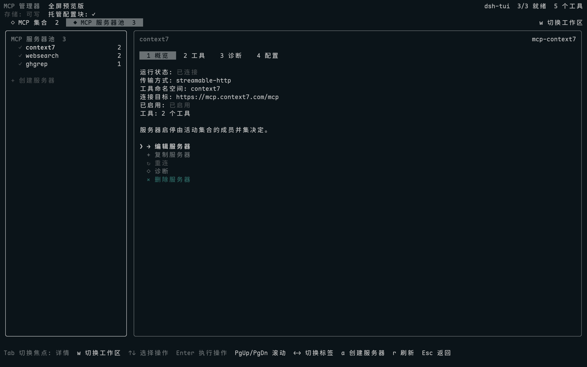

# dsh-tui-mcp-manager

[English](README_EN.md) | 中文

面向 [dsh-TUI](https://github.com/ccch1mneyyy/dsh-TUI) 的原生 MCP Server 管理插件。
在聊天界面输入 `/mcp-manager`，即可打开原生全屏 MCP 控制台，管理 MCP CRUD、Sets、服务器复制、
Tool schema、Doctor 与 DSH credential reference。所有服务器变更直接写入当前 profile 的
`cordis.patch.yml`，不引入额外配置数据库。插件要求 dsh-TUI 0.9.3 或更高的 0.9.x 版本。

## 界面预览



其他界面：[Set 管理](docs/images/mcp-manager-sets.png) ·
[工具列表](docs/images/mcp-manager-tools.png) ·
[创建 Set](docs/images/mcp-manager-set-editor.png) ·
[创建服务器](docs/images/mcp-manager-server-editor.png)

## 功能

- 全屏界面使用 Set / 服务器池工作区和左右双栏布局；服务器概览、工具与 Schema、诊断和配置
  分为独立标签，长内容只滚动右栏，不会破坏左侧导航。
- 导航与详情拥有明确焦点，`Tab` 切换区域，方向键选择节点、操作和工具；60、80、120 列终端
  使用同一套键位并按可用高度分页。
- 添加、复制、编辑、启停、重连和删除 MCP server；复制会生成新的 ID 与工具命名空间，默认保持禁用，并在完整表单确认后写入。
- MCP Sets 将多个已有服务器 ID 保存为集合；所有 Set 在树中独立启停，实际启用状态取活动 Set 的成员并集。重复成员仍只对应一个 Loader row，因此只启动一次；切换通过一次 `cordis.patch.yml` 批量写入完成。
- Set 详情显示成员及其运行状态，Set 编辑器直接从全局服务器池切换成员；服务器工作区可创建
  全新 MCP，或全局删除服务器并自动清理所有 Set 引用。
- 工具页可查看完整的已注册工具列表、说明与输入 Schema；列表和 Schema 使用右栏的局部窗口滚动。
- Doctor 标签在打开时自动检查 Loader/Fiber、可执行文件或 URL、工作目录、凭据、现有运行时和工具数；失败项附带针对性的修复建议。重测复用 Loader/HMR，不会额外建立 MCP 连接。
- 完整配置 stdio 与 streamable-http transport。
- 编辑参数、工作目录、环境变量、请求头、超时、启动失败策略与自动重连参数。
- 敏感环境变量和请求头通过任意 DSH credential reference 保存，不写死 credential 名称。
- 全屏表单在字段中按 Enter 返回表单导航，按 Esc 取消整个表单；保存和取消也都是可选择的行。
- 打开管理器时读取 dsh-TUI 的 `/lang zh` 与 `/lang en` 语言选择。
- 表格和表单字段按终端单元格对齐，不依赖普通空格通过宿主 sanitizer。
- 图标沿用 dsh-TUI 风格的标准 Unicode 字符，不依赖 emoji 或私用区字体。

## 安装

要求 Node.js `^22.19 || >=24` 与 dsh-TUI `>=0.9.3 <0.10.0`；当前验证基线是 dsh-TUI 0.9.3。

```sh
dsh plugin --profile dsh-tui add dsh-tui-mcp-manager
dsh --profile dsh-tui
```

该命令从 npm 安装正式发布包。普通用户不需要 clone 或构建仓库，也不需要执行
`pnpm approve-builds` 或修改 profile 的 `allowBuilds`。

进入 TUI 后输入：

```text
/mcp-manager
```

服务器与 Sets 都从这个入口管理，不额外暴露子命令参数。

语言由 dsh-TUI 统一管理：

```text
/lang zh
/lang en
```

卸载插件：

```sh
dsh plugin --profile dsh-tui remove dsh-tui-mcp-manager
```

## 文件原生化

`cordis.patch.yml` 是服务器配置的唯一事实源：

```text
dsh-TUI full-screen Scene
    -> atomic update of a managed block
$DSH_HOME/profiles/dsh-tui/cordis.patch.yml
    -> DSH patch watcher
Cordis Loader / HMR
    -> @deepseek-ai/dsh-mcp-client
```

服务器配置仍以 `cordis.patch.yml` 为唯一事实源；Set 定义单独保存在当前 profile 的
`mcp-manager.sets.yml`，只引用服务器 ID，不复制命令、endpoint 或凭据。Set 文件与服务器 patch
都使用同目录临时文件、fsync 和原子 rename。插件持久化多个活动 Set，启停节点时先计算所有活动
Set 的成员并集，再对服务器 patch 执行一次批量写入，不会循环调用单服务器启停。首次没有集合
时会自动创建一个包含当时全部 MCP 的“默认”集合；它保存后就是普通 Set，可以照常启停和编辑。

插件只修改下面的兼容 marker block，marker 外的 patch、注释和 `!!js` 表达式保持原样：

```yaml
# >>> dsh-mcp-manager: managed MCP server rows >>>
- insert:
    - id: mcp-manager--filesystem
      name: '@deepseek-ai/dsh-mcp-client'
      config:
        transport: stdio
        serverName: filesystem
        command: npx
        args: ['-y', '@modelcontextprotocol/server-filesystem', /workspace]
        env: {}
        cwd: ''
      x-dsh-mcp-manager:
        id: filesystem
        name: Filesystem
# <<< dsh-mcp-manager: managed MCP server rows <<<
```

保留旧 marker、row prefix 与 metadata key 是为了兼容已有配置，已有服务器无需复制。
含 credential reference 的 row 会在下一次保存时使用
`dsh-tui-mcp-manager/server` 适配器。

写入采用旁路锁、同目录临时文件、fsync 和原子 rename。提交前会同时校验 managed block
和整个 Cordis YAML 文件。

## 凭据相关

普通字段直接交给官方 MCP client。敏感字段只保存 credential reference，实际值通过 DSH
credentials API 写入。例如 Context7：

```text
Transport:          streamable-http
URL:                https://mcp.context7.com/mcp
Secret header:      api-key=MY_CONTEXT7_KEY
Credential value:   <your key>
```

`MY_CONTEXT7_KEY` 只是示例引用名，可以换成任何有效的 POSIX 标识符。profile patch 中只会出现：

```yaml
secretHeaders:
  api-key:
    ref: MY_CONTEXT7_KEY
    prefix: ''
```

全屏表单用圆点遮蔽正在输入的 credential value；保存后的服务器总览、profile patch 和 RPC
snapshot 都不会显示真实值。

## dsh-TUI 扩展契约

本包按当前社区约定提供：

- 独立仓库、MIT、纯 ESM、语义化版本与 Node engine 约束。
- 根入口只导出 Cordis `name`、`Config`、`apply`，不提供 default export。
- 相对导入使用 `.js`，TypeScript 生成 JS、source map 与 declaration。
- `dsh-plugin.json` 声明 Command contract、`commands.invoke` 权限与 Host facet。
- 通过 `ctx.get('tuiPluginHost', false)` 使用 mediated command registration。
- `tuiScenes` 是唯一界面能力；`tuiCommandTrees` 和 `tuiPluginHost` 按能力探测。缺少 Scene API
  时不注册不可用的命令，也不能阻止 TUI 启动。
- 每个注册和子 fiber 都绑定 Cordis 生命周期并在卸载时清理。

dsh-TUI 0.9.3 提供本插件使用的 Scene API 与 mediated command API，也是当前构建和运行验证
基线。普通 Cordis Loader row 尚不一定自动绑定 Component identity。只有宿主明确返回
`COMPONENT_NOT_ADMITTED` 时，本包才改用基础 `commands.register`；权限拒绝、manifest 不兼容
或其他 admission 错误不会绕过。

本仓库保持作者独立所有权，并使用无 scope 包名 `dsh-tui-mcp-manager`；这与
[dsh-TUI 生态收录标准](https://github.com/dsh-tui-ecosystem/dsh-tui-ecosystem/blob/main/CONTRIBUTING.md)
允许作者提交自有公开 GitHub 仓库、`npm` 字段可为空的模式一致，不需要为了收录迁移仓库或预占组织
scope。`lib/types/` 构建产物按模板约定纳入版本库，并随 npm 包发布。包不提供 `prepare`，因此
安装正式发布包时不会在用户机器上执行 TypeScript 构建；`prepack` 只负责在发布者打包时执行
完整检查。

社区 manifest v0.15 目前仍是 experimental draft，本 README 只声明兼容该草案，不声称得到
官方认证。插件在宿主进程内运行，manifest permissions 是审计和宿主策略提示，不是操作系统
安全沙箱；安装等同于信任本包拥有当前用户对 profile patch 与 credentials provider 的权限。

## 从源码开发

```sh
git clone https://github.com/0N3-0/dsh-tui-mcp-manager.git
cd dsh-tui-mcp-manager
pnpm install --frozen-lockfile
pnpm check
dsh plugin --profile dsh-tui add .
```

本地 `add .` 用于开发联调，不是普通用户的安装方式。

## 构建与发布检查

```sh
pnpm typecheck
pnpm build
pnpm verify
npm pack --dry-run
pnpm smoke:package
```

`smoke:package` 会创建真实 tarball，在临时 consumer 目录安装后检查 root/server 入口可
resolve 和 import，并验证 bundle patch、manifest 入口与必要 runtime 文件都已进入包中。

维护者发布新版本时，需要同步更新 `package.json` 与 `dsh-plugin.json` 的版本，并创建同名
GitHub Release tag（例如 `v0.2.0`）。`.github/workflows/publish.yml` 会重新执行发布校验，然后
使用 npm Trusted Publishing 的 GitHub Actions OIDC 身份发布，不在仓库中保存 npm token。

构建产物：

```text
lib/types/index.js         Cordis 根入口
lib/types/plugin.js        文件管理服务与 TUI 接入
lib/types/server/index.js  credential-aware 单服务器适配器
lib/types/tui/index.js     /mcp-manager 与全屏 Scene 注册
lib/types/tui/scene.js     原生全屏 Scene
```

目录结构：

```text
dsh-plugin.json         社区 v0.15 experimental manifest
cordis.patch.yml        单一 Cordis Loader row
src/index.ts            精简的 Cordis 公共契约
src/plugin.ts           运行时组合与生命周期入口
src/host/               patch store、状态投影和配置 schema
src/host/set-store.ts   profile-local Set 定义与原子文件写入
src/server/             credential-aware MCP client 适配器
src/tui/                dsh-TUI 全屏 Scene、控制器和共享表单
scripts/verify.mjs      manifest 与 Cordis 入口契约检查
```
